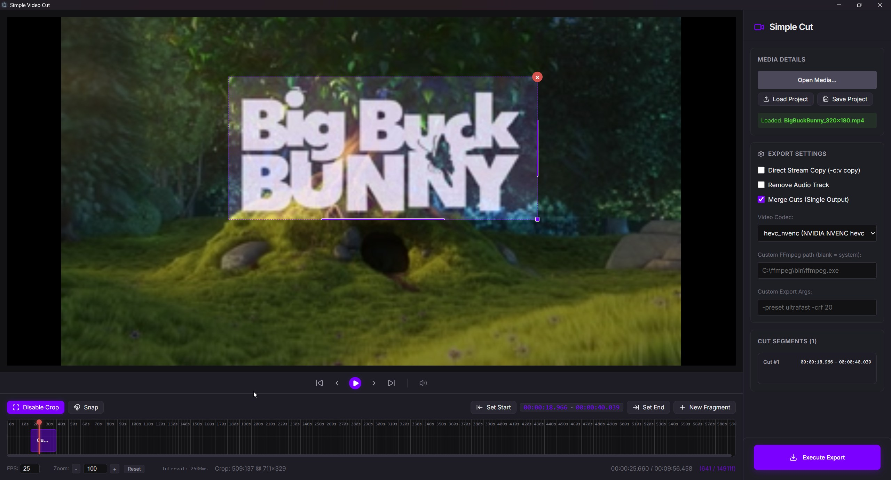

# Simple Video Cut



**Simple Video Cut** is a professional, high-performance desktop application built with Electron and React designed for ultra-fast video segment extraction. It leverages the power of native FFmpeg for lossless cutting (Direct Stream Copy) and high-speed hardware-accelerated encoding, while providing a seamless browser-based WASM fallback for maximum portability.

## 🚀 Key Features

- **Native FFmpeg Engine**: Blazing fast video processing using your system's FFmpeg binary.
- **Direct Stream Copy**: Lossless cutting without re-encoding (instant exports).
- **Region Cropping**: Visual cropping tool to extract specific areas of your video.
- **Hardware Acceleration**: Support for modern hardware encoders like `hevc_nvenc`, `h264_amf`, and more.
- **WASM Fallback**: Fully functional browser-based fallback if native tools are unavailable.
- **Project Persistence**: Save and load your cut segments as JSON projects (`.llc`).
- **Precision Timeline**: Snapping and frame-accurate seeking for perfect cuts.
- **Custom Arguments**: Power-user field for manual FFmpeg command overrides.

## 🛠️ Development

This project was built with Vite, React, and Electron.

### Prerequisites
- Node.js (v18+)
- FFmpeg (Global installation recommended for best performance)

### Setup
```bash
# Install dependencies
npm install

# Run in development mode
npm run dev
```

## 📦 Building Installer

Generate a production-ready installer for Windows, Linux, or macOS:

```bash
# Build the application
npm run build

# Generate installers (Output in /release folder)
npm run electron:build
```

## 📄 License
This project is for internal use. All rights reserved.
